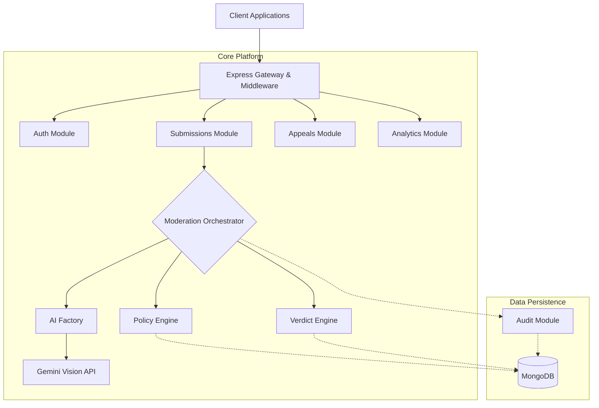
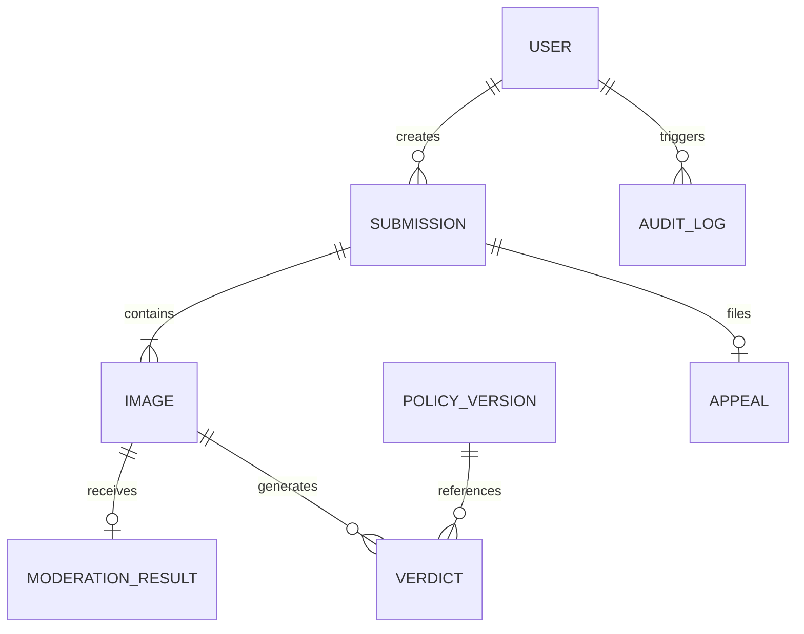
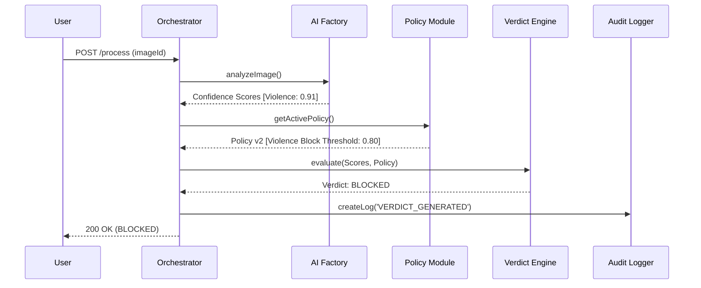
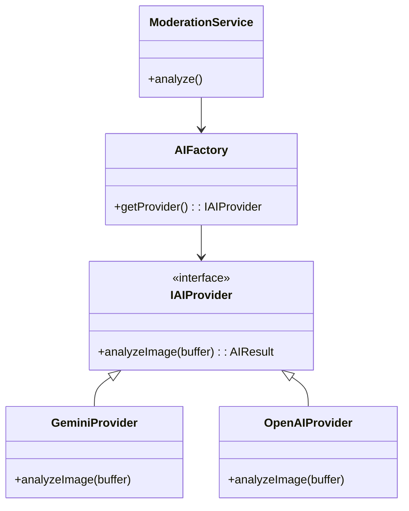

# Architecture Design Document (ADD)
**Project:** AI Content Moderation Platform  
**Version:** 1.0.0  

---

## 1. Executive Summary
The AI Content Moderation Platform is an enterprise-grade backend service designed to automate content safety screening for user-generated images. Built on a modular Node.js/Express stack using TypeScript and MongoDB, the platform enforces strict separation between AI analysis, deterministic policy evaluation, and compliance auditing. It is designed to be provider-agnostic, currently utilizing Gemini Vision with seamless adaptability for future Large Multimodal Models (LMMs).

## 2. Architecture Overview
The platform follows a Domain-Driven Design (DDD) philosophy. The architecture isolates core business logic into specific bounded contexts, orchestrated by a central pipeline to ensure idempotent execution.

## 3. Module Responsibilities
- **Auth Module:** Manages JWT issuance and Role-Based Access Control (RBAC) separating `USER` and `ADMIN` privileges.
- **Policies Module:** Manages versioned, immutable rulesets that define categorical safety thresholds (e.g., Violence = 0.8).
- **Submissions Module:** Handles multipart file uploads and logical grouping of images tied to specific user accounts.
- **Moderation Module:** Interfaces with external AI providers via the Strategy Pattern. Abstracts provider-specific SDKs into uniform system interfaces.
- **Verdict Module:** A deterministic rules engine. Compares AI confidence scores against the currently active Policy to output `APPROVED`, `FLAGGED`, or `BLOCKED`.
- **Audit Module:** A write-only system ledger. Monitors mongoose pre/post hooks to ensure all state changes leave a tamper-proof trail.
- **Appeals Module:** Provides a workflow for users to challenge moderation outcomes. Contains a FIFO admin queue for non-destructive verdict overrides.
- **Analytics Module:** Executes complex MongoDB Aggregation Pipelines to deliver real-time system KPIs and trends.

## 4. Database Architecture
The database is heavily normalized to prevent document bloat and support scalable indexing.

**Key Data Decisions:**
- **Foreign Keys Over Embedding:** Images reference `submissionId` rather than arrays of objects inside Submissions, ensuring `$facet` aggregations remain highly performant without blowing up the 16MB document limit.
- **Idempotency:** Unique compound indexes ensure duplicated pipeline executions do not create duplicated state.

## 5. Moderation Workflow
The Orchestrator coordinates the lifecycle, ensuring no module holds cross-domain responsibilities.

## 6. Policy Versioning Design
To guarantee historical compliance, policies are **Immutable**. 
- Updating a rule (e.g., changing Hate Speech threshold from 0.8 to 0.7) creates a completely new `PolicyVersion` document.
- Verdicts permanently store a reference to the `policyId` that was active at the exact millisecond they were generated.
- *Benefit:* A user cannot sue the platform for a 2024 verdict based on a rule implemented in 2026.

## 7. AI Provider Abstraction
The system utilizes the **Factory & Strategy Patterns** to ensure vendor lock-in is impossible.

## 8. Verdict Engine Design
The Verdict Engine guarantees **Determinism**. AI models suffer from hallucination and prompt drift. By forcing the AI to only return numerical probabilities, the Verdict Engine applies hard-coded mathematical rules (`score > policy.threshold`). This separation protects the business from rogue AI decisions.

## 9. Audit Logging Design
All destructive or state-altering routes pass through the Audit Module.
- Built utilizing Mongoose `pre-save` and `pre-findOneAndUpdate` hooks.
- Write-once architecture. No update or delete routes exist for Audit logs.
- Stores `actorId`, `previousState`, and `newState` for flawless retroactive tracing.

## 10. Appeals Workflow
The Appeals process is entirely **Non-Destructive**.
- When an Admin approves an appeal, the original `BLOCKED` verdict is NOT deleted.
- A new `APPROVED_VIA_APPEAL` verdict is appended to the ledger.
- This ensures metrics like "AI False Positive Rate" remain mathematically calculable in the Analytics pipeline.

## 11. Security Design
- **Environment Gateway:** Strict `Zod` validation parses `.env` parameters, failing fast (`process.exit(1)`) on boot if tokens/DB URIs are missing.
- **Traffic Shaping:** `Helmet` obscures standard express headers. `Cors` dictates strict ingress access.
- **Payload Limits:** 10kb JSON payload cap thwarts DoS memory attacks.
- **Authentication:** Stateless, expiration-bound JWTs verified via centralized middleware.

## 12. Scalability Considerations
- **Stateless Execution:** The Express layer holds zero session state. It scales horizontally seamlessly behind a load balancer.
- **Aggregation Pipelines:** Complex analytics offload processing to MongoDB's C++ engine via `$facet` and `$unwind` rather than thrashing the V8 JavaScript thread.
- **Graceful Shutdowns:** Intercepts `SIGTERM/SIGINT` to safely drain open HTTP sockets and terminate Mongoose connection pools without stranding queries.

## 13. Future Improvements
1. **Asynchronous Processing:** Move the Orchestrator off the HTTP request/response cycle into a Redis-backed message queue (e.g., BullMQ) for immediate 202 Accepted responses during high load.
2. **S3 Object Storage:** Migrate from local file system Multer to AWS S3 / Cloudflare R2 to support distributed container environments.
3. **Webhooks:** Allow enterprise clients to register webhook URLs to receive asynchronous verdict results.
